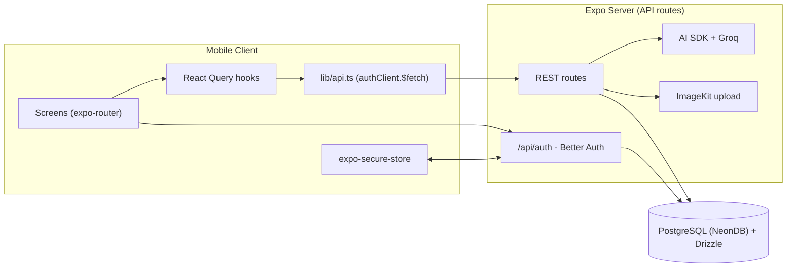
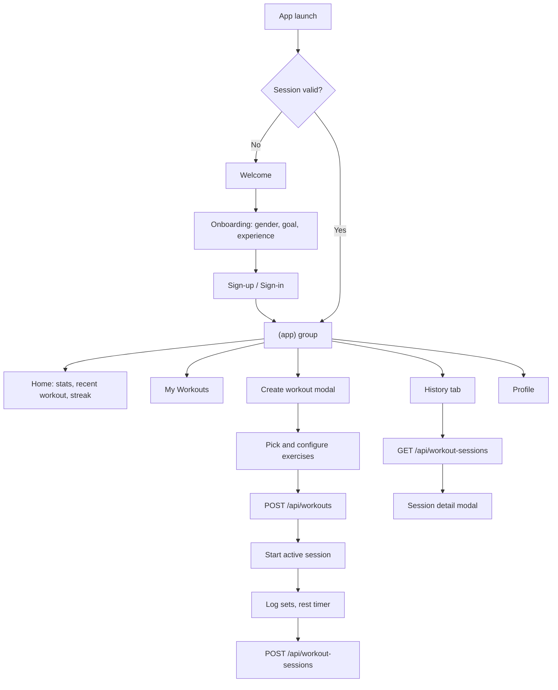
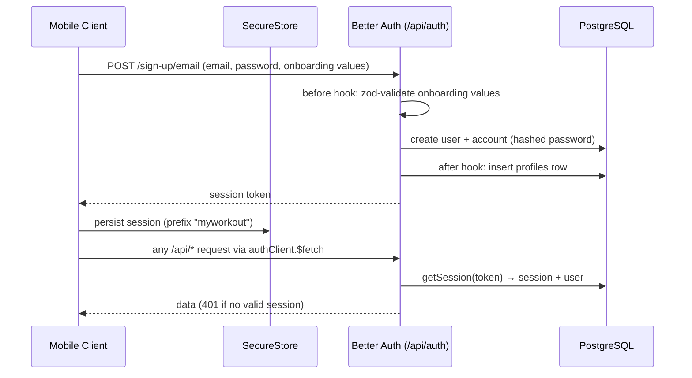
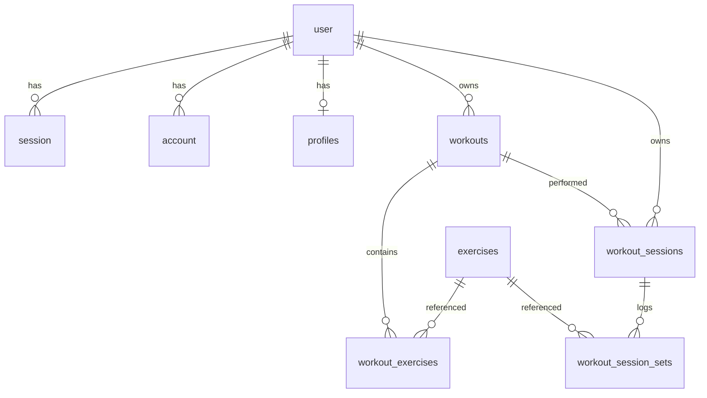

<div align="center">

# 🏋️ MyWorkout (ai-workout-tracker)

**Track. Train. Transform.**

An AI-powered mobile workout tracker built with **Expo (React Native)**, **Expo Router**, and **Better Auth**, with an AI fitness coach powered by **Groq**.


</div>

---

## 1. Project Overview

**MyWorkout** is a cross-platform (iOS/Android) fitness application that lets users build custom workouts, run guided workout sessions with a live timer and rest countdowns, and track their long-term training history, streaks, and statistics.

The problem it solves: most gym-goers juggle spreadsheets, notes apps, and memory to track exercises, sets, reps, and progress. MyWorkout consolidates **workout building → session execution → history & analytics** into one app, and layers an **AI Coach** on top that generates step-by-step instructions for any exercise on demand.

## 2. About the Project

- **Purpose:** Personal training companion for building muscle, losing fat, or maintaining fitness, with full progress tracking.
- **Target users:** Anyone training in a gym or at home who wants structured workout planning and progress tracking.
- **Key functionality:**
  - Email/password + Google OAuth authentication.
  - A 3-step onboarding questionnaire (gender, goal, experience) captured before sign-up.
  - A searchable exercise catalog (seeded from the open-source [free-exercise-db](https://github.com/yuhonas/free-exercise-db)).
  - Custom workout builder with sets, reps, rest, and target weight per exercise, plus optional cover images uploaded to ImageKit.
  - An "active workout" mode with a real-time elapsed timer, per-set logging, and rest countdowns.
  - Workout history with per-session detail (sets, reps, weight, total volume) and a calendar of training days.
  - Home dashboard with daily stats (workouts, total time, average time) and a streak system (current/best streak).
  - AI-generated exercise instructions in an "AI Coach" bottom-sheet modal.

## 3. Key Features

| Feature | Description |
|---|---|
| 🔐 **Authentication** | Email/password and Google OAuth via Better Auth; native session tokens stored securely with `expo-secure-store`. |
| 📋 **Onboarding** | Gender → Goal → Experience questionnaire persisted locally (AsyncStorage) and saved server-side into a `profiles` row at sign-up. |
| 🏋️ **Workout Builder** | Full-screen modal flow: pick exercises from a searchable catalog, configure sets/reps/rest/target weight, add a cover photo. |
| 🤖 **AI Coach** | Server-side AI generation of 4–5 concise, safety-focused instructions per exercise using Groq. |
| ⏱️ **Active Session** | Live workout timer with pause/resume, per-exercise rest countdowns, and set logging. Sessions are saved to the database on completion. |
| 📅 **History & Calendar** | FlatList of past sessions, drill-down session detail with volume calculation, calendar day markers from the Home week calendar. |
| 🔥 **Streaks** | Current/best day-streak computed client-side from session dates, with a bottom-sheet breakdown. |
| 🌗 **Dark/Light Theme** | NativeWind-based theming driven by the OS color scheme, with a manual toggle on the Profile tab. |

## 4. Tech Stack

- **Runtime / Framework:** Expo SDK 57 · React Native 0.86 · React 19 · expo-router 57
- **Language:** TypeScript (strict mode)
- **Package manager:** [Bun](https://bun.sh) (`bun.lock`)
- **Backend API:** Expo Router file-based API routes (`+api.ts`) running inside the Expo server
- **Database:** PostgreSQL (NeonDB) via [Drizzle ORM](https://orm.drizzle.team) + `drizzle-kit`
- **Authentication:** [Better Auth](https://better-auth.com) with the `@better-auth/expo` plugin (email/password + Google OAuth)
- **Data fetching:** TanStack React Query v5
- **Styling:** NativeWind 4 (Tailwind CSS 3 for React Native), `expo-linear-gradient`
- **Forms:** react-hook-form + `@hookform/resolvers` + Zod
- **AI:** [Vercel AI SDK](https://sdk.vercel.ai) (`ai`) with the `@ai-sdk/groq` provider (Groq-hosted `openai/gpt-oss-20b`)
- **Image uploads:** ImageKit (`/workouts` folder, Basic-auth upload API)
- **Fonts & icons:** `@expo-google-fonts/inter`, `@expo/vector-icons` (Feather, FontAwesome)
## 5. Tech Stack Explanation

| Technology | Why it's used |
|---|---|
| **Expo / React Native** | One TypeScript codebase targeting iOS and Android with native modules (SecureStore, ImagePicker) preconfigured. |
| **expo-router** | File-based routing with typed routes, nested stacks/tabs/modals, and `Stack.Protected` route guards — the same model powers both screens **and** API routes (`+api.ts`). |
| **Better Auth + @better-auth/expo** | Full-featured auth server (sessions, OAuth accounts, trusted origins) with an Expo client plugin that persists session tokens in the device keystore and handles deep-link redirects back into the app. |
| **Drizzle ORM + drizzle-kit** | Type-safe SQL schema/migrations with aggregate helpers (`count`, raw `sql` templates) and transactions for multi-table writes. |
| **TanStack React Query** | Declarative server-state caching; queries are keyed (`["workout", id]`, `["history", { limit }]`, …) so refetching, retries, and loading states are centralized in `hooks/queries`. |
| **NativeWind / Tailwind** | Utility-class styling with CSS-variable theming (`vars()`), dark mode via the OS `useColorScheme`. |
| **react-hook-form + Zod** | Validated sign-in/sign-up forms; the same Zod schemas mirror server-side validation (`onboardingValuesSchema` is used by both the client and Better Auth's hooks). |
| **Vercel AI SDK + Groq** | Structured LLM output (`Output.object` with a Zod schema) for instruction generation; Groq provides fast inference on `openai/gpt-oss-20b`. |
| **ImageKit** | Cloud storage for workout cover images, uploaded server-side so the private API key never reaches the client. |

## 6. System Architecture

The app is a **single Expo project** that hosts both the React Native client and the server-side API. The mobile client talks to the API (`EXPO_PUBLIC_API_URL`) over HTTP, with Better Auth session tokens attached automatically by `authClient.$fetch`.



- **Client → API:** every data operation goes through a query/mutation hook in `src/hooks/{queries,mutations}`, which calls a typed function in `src/lib/api.ts`. That layer uses Better Auth's `$fetch`, which injects the session token from SecureStore.
- **Server → DB:** API routes use Drizzle ORM (`src/database`) with a `pg` connection pool.
- **Server → AI:** only `GET /api/exercises/[id]/instructions` calls Groq, server-side only.
## 7. Complete Folder Structure

```
ai-workout-tracker/
├── app.json                     # Expo config (scheme: aiworkouttracker, typed routes, react compiler)
├── package.json                 # Scripts + dependencies (managed with Bun)
├── bun.lock                     # Lockfile
├── eslint.config.js             # Flat ESLint config (eslint-config-expo)
├── tsconfig.json                # Strict TS, @/* → ./src/* path alias
├── drizzle.config.ts            # drizzle-kit: schema, ./drizzle migrations, DATABASE_URL
├── drizzle/                     # Generated SQL migrations
├── global.css                   # Tailwind/NativeWind entry stylesheet
├── assets/                      # Images, fonts, splash assets
├── .env.example                 # All required environment variables
└── src/
    ├── app/                     # expo-router app directory
    │   ├── _layout.tsx          # Root: fonts, QueryClientProvider, theme, auth route guards
    │   ├── (public)/            # Unauthenticated group
    │   │   ├── welcome.tsx      # Landing screen
    │   │   ├── sign-in.tsx      # Email/password + Google sign-in
    │   │   ├── sign-up.tsx      # Registration
    │   │   └── onboarding/[step].tsx  # Gender/Goal/Experience wizard
    │   ├── (app)/               # Authenticated group (guarded by Stack.Protected)
    │   │   ├── _layout.tsx      # StreakProvider + modal stack
    │   │   ├── (tabs)/          # index (Home) · workouts · create (FAB) · history · profile
    │   │   └── (modal)/
    │   │       ├── history/[id].tsx       # Session detail modal
    │   │       └── workout/               # Workout builder + runner
    │   │           ├── create.tsx         # Create workout
    │   │           ├── exercises/         # Catalog browse + exercise detail
    │   │           └── [id]/{index,active}.tsx  # Workout overview · active session
    │   └── api/                 # Server-side REST routes (see §12)
    ├── components/
    │   ├── ui/                  # button, empty-state, safe-area-screen, skeleton
    │   ├── home/                # home-stats, recent-workout, my-workouts, streak-bottom-sheet, …
    │   ├── exercise/            # ai-coach-modal
    │   └── onboarding/          # gender-step, goal-step, experience-step, option-card
    ├── constants/onboarding.ts  # Step definitions + AsyncStorage-backed answers
    ├── contexts/                # streak-context, workout-draft-context (React contexts)
    ├── database/                # index.ts (pg pool + Drizzle), schema.ts, auth-schema.ts, seed/
    ├── hooks/
    │   ├── queries/             # exercises, history, stats, workouts (React Query)
    │   ├── mutations/           # workouts (create workout / save session)
    │   ├── use-debounce.ts      # Generic debounce
    │   └── use-workout-timer.ts # Active-session elapsed + rest countdown timer
    ├── lib/
    │   ├── api.ts               # Typed fetch layer (query fns + mutation fns)
    │   ├── auth.ts              # Better Auth server instance
    │   ├── auth-client.ts       # Better Auth Expo client + API_URL
    │   ├── imagekit.ts          # Server-side image upload helper
    │   ├── streak.ts            # Streak computation (current/best)
    │   ├── format.ts            # Date/duration formatting helpers
    │   ├── utils.ts             # Misc utilities (status bar style, cn)
    │   └── validations/         # Zod schemas (auth, onboarding)
    ├── theme/app-theme.ts       # Light/dark palettes → CSS variables
    └── types/                   # index.ts barrel + api.ts (13 shared API DTO types)
```

## 8. Application Flow

1. **Launch** — `app/_layout.tsx` loads fonts, hides the splash screen, and reads the session via `authClient.useSession()`. `Stack.Protected` guards decide which group renders: no session → `(public)`, session → `(app)`.
2. **Welcome & Onboarding** — new users land on `/welcome` and walk through `/onboarding/[step]` (gender → goal → experience). Answers are stored in AsyncStorage and validated with `onboardingValuesSchema`.
3. **Sign-up** — `sign-up.tsx` posts to Better Auth (`authClient.signUp.email`) passing the onboarding values in the body. The server validates them in a `before` hook and, in an `after` hook, inserts a `profiles` row for the new user.
4. **Home tab** — once authenticated, Home loads daily stats (`useHomeStatsQuery`), the recent workout (`useHistoryQuery(1)`), user workouts (`useWorkoutsQuery(4)`), calendar dates (`useWorkoutCalendarDatesQuery`), and the streak (`useStreakQuery`).
5. **Workout creation** — the center tab FAB opens the full-screen `(modal)/workout` flow. Exercises are chosen from `/api/exercises` (debounced search), configured, and submitted via `useCreateWorkoutMutation`. An optional cover photo is base64-uploaded to ImageKit server-side.
6. **Active session** — starting a workout from `workout/[id]` opens `[id]/active.tsx`, which runs `useWorkoutTimer` (elapsed time + rest countdown), records each completed set, and on finish calls `useCreateWorkoutSessionMutation` → `POST /api/workout-sessions`, which verifies workout ownership and stores the session + sets in one transaction.
7. **History** — the History tab lists all sessions (`useHistoryQuery`), and tapping one opens a modal with `useHistoryDetailQuery` showing per-exercise sets and computed volume.



## 9. Authentication Flow



- **Google OAuth** uses Better Auth's social provider with the Expo plugin's deep-link scheme (`aiworkouttracker://`) listed in `trustedOrigins`.
- **Route protection (client):** the root layout conditionally mounts `(public)` or `(app)` via `Stack.Protected` guards bound to the session state — there is no manual redirect logic.
- **Route protection (server):** every REST route independently calls `auth.api.getSession({ headers })` and returns **401** when there is no session. Never rely on the client guard alone.

## 10. Database Architecture

PostgreSQL, accessed via Drizzle ORM. Schema lives in `src/database/schema.ts` (app tables) and `src/database/auth-schema.ts` (Better Auth tables).

### Better Auth tables (`auth-schema.ts`)
| Table | Purpose |
|---|---|
| `user` | id (text), name, unique email, emailVerified, image, timestamps |
| `session` | session tokens, expiry, IP/user-agent; indexed by `userId` |
| `account` | OAuth/credential accounts (provider id, tokens, password hash); indexed by `userId` |
| `verification` | verification tokens (email verification, OAuth state) |

### Application tables (`schema.ts`)
| Table | Columns (key) | Notes |
|---|---|---|
| `profiles` | userId → user (cascade), gender, goal, experience, weightUnit | Created by the Better Auth `after` hook on sign-up |
| `workouts` | userId → user (cascade), name, description, image, isTemplate | `isTemplate=false` = user's real workouts |
| `exercises` | userId, unique slug, name, image, description, muscles, equipment, difficulty, forceType, mechanics, category | Seeded catalog (currently bound to a seed user) |
| `workout_exercises` | workoutId → workouts (cascade), exerciseId → exercises (cascade), sets, reps, targetWeight, restSeconds, position | Ordered by `position` |
| `workout_sessions` | userId, workoutId, startedAt, completedAt, durationSeconds | One row per completed workout run |
| `workout_session_sets` | sessionId → workout_sessions (cascade), exerciseId, setNumber, reps, weight | One row per logged set |

### Relationships


**How workout/session data is stored:** a workout template is a `workouts` row plus ordered `workout_exercises` rows. When a session completes, `POST /api/workout-sessions` runs in a **transaction**: verify the workout belongs to the caller → insert the `workout_sessions` row → filter submitted sets to exercises that actually belong to that workout → bulk-insert `workout_session_sets`. All FKs cascade on delete, so removing a user (or workout) cleans up its sessions and sets automatically.

## 11. REST API Reference
       226-marker

Base URL: `EXPO_PUBLIC_API_URL` (development: your Expo server host). All routes except `/hello` require a Better Auth session (`401` otherwise). Errors use `{ error: string }` with proper status codes (400 invalid input, 401 unauthenticated, 404 not found, 500 server error) — raw validation internals are never leaked to the client.

### Auth (`/api/auth/[...auth]`)
Better Auth catch-all: `sign-up/email`, `sign-in/email`, `sign-out`, Google OAuth, session endpoints. Handled entirely by Better Auth with the Expo plugin.

### Workouts
| Method | Route | Body / Query | Returns |
|---|---|---|---|
| GET | `/api/workouts` | `?limit` (optional, int 1–50) | `{ workouts: WorkoutSummary[] }` — caller's workouts, newest first |
| POST | `/api/workouts` | `{ name, description?, image?, exercises: [{ exerciseId, sets, reps, targetWeight, restSeconds, position }] }` | `{ workout: { id } }` |
| GET | `/api/workouts/[id]` | — | `{ workout }` with exercises ordered by `position`; 404 if not owned |
| PATCH | `/api/workouts/[id]` | Same shape as POST (replaces exercises) | `{ success: true }` |
| DELETE | `/api/workouts/[id]` | — | `{ success: true }` (cascade deletes exercises) |

`POST /api/workouts` also accepts an optional `base64` cover image, which is uploaded to ImageKit (`/workouts` folder) before the DB insert; upload failure doesn't fail workout creation.

### Workout sessions
| Method | Route | Body / Query | Returns |
|---|---|---|---|
| GET | `/api/workout-sessions` | `?limit` (optional, int 1–50) | `{ sessions: SessionSummary[] }` with exercise count |
| POST | `/api/workout-sessions` | `{ workoutId, startedAt, completedAt, durationSeconds, sets: [{ exerciseId, setNumber, reps, weight }] }` | `{ session: { id } }` (transaction; sets filtered to the workout's exercises) |
| GET | `/api/workout-sessions/[id]` | — | `{ session }` with per-exercise sets + volume; 404 if not owned |
| GET | `/api/workout-sessions/calendar` | `?year` (default current) | `{ workoutDates: string[] }` — ISO dates with ≥1 session |
| GET | `/api/workout-sessions/streak` | — | `{ workoutDates: string[] }` (streak computed client-side in `lib/streak.ts`) |

### Exercises
| Method | Route | Body / Query | Returns |
|---|---|---|---|
| GET | `/api/exercises` | `?search` (trimmed, 1–100 chars) | `{ exercises }` — public catalog, LIKE search on name (escaped, `%`/`_` literal) |
| GET | `/api/exercises/[id]` | — | `{ exercise }` (safe columns only: no userId/slug/createdAt) |
| GET | `/api/exercises/[id]/instructions` | — | `{ instructions: string[] }` — AI-generated via Groq (`openai/gpt-oss-20b`), 4–5 safety-focused steps; 503 if AI unavailable |

### Other
| Method | Route | Returns |
|---|---|---|
| GET | `/api/home-stats` | `{ stats: { workouts, totalSeconds, avgSeconds } }` for today |
| GET | `/api/hello` | `{ message: "Hello from Expo Router API!" }` — public smoke-test route |

## 12. React Query Hooks

| Hook | File | Key | Notes |
|---|---|---|---|
| `useExercisesQuery(search?)` | `hooks/queries/exercises.ts` | `["exercises", { search }]` | Catalog browse; debounced search |
| `useExerciseQuery(id)` | `hooks/queries/exercises.ts` | `["exercises", "detail", id]` | Exercise detail screen |
| `useWorkoutQuery(id)` | `hooks/queries/workouts.ts` | `["workout", id]` | Workout overview |
| `useWorkoutsQuery(limit=50)` | `hooks/queries/workouts.ts` | `["workouts", { limit }]` | Home "My Workouts" section |
| `useHistoryQuery(limit)` | `hooks/queries/history.ts` | `["history", { limit }]` | History list (no limit = all sessions) |
| `useHistoryDetailQuery(id)` | `hooks/queries/history.ts` | `["history", "detail", id]` | Session detail modal |
| `useHomeStatsQuery()` | `hooks/queries/stats.ts` | `["home-stats"]` | Daily stats |
| `useWorkoutCalendarDatesQuery(year)` | `hooks/queries/stats.ts` | `["workout-calendar", year]` | Calendar markers |
| `useStreakQuery()` | `hooks/queries/stats.ts` | `["streak"]` | Streak dates (typed `WorkoutCalendarDates` — same response shape) |
| `useCreateWorkoutMutation()` | `hooks/mutations/workouts.ts` | — | Invalidates workout + history caches |
| `useCreateWorkoutSessionMutation()` | `hooks/mutations/workouts.ts` | — | Saves a session; invalidates history/stats/calendar/streak |

## 13. Other Hooks

| Hook | File | Purpose |
|---|---|---|
| `useDebounce` | `hooks/use-debounce.ts` | Returns a value that updates after a configurable delay (used for exercise search). |
| `useWorkoutTimer` | `hooks/use-workout-timer.ts` | Drives the active session: elapsed seconds since start, `startWorkoutTimer`/`pauseWorkoutTimer`/`resumeWorkoutTimer`/`stopWorkoutTimer`, and a `restCountdown` with `startRestCountdown(seconds)` — the rest timer counts down and clears at zero, and the elapsed timer keeps the session duration accurate while resting. |
| `useStreak` | `contexts/streak-context.tsx` | Computes current/best streak from streak dates (`lib/streak.ts`), stores progress in context, and exposes the breakdown bottom sheet. |

## 14. AI Integration (AI Coach)

- **Endpoint:** `GET /api/exercises/[id]/instructions`
- **Provider:** Groq via `@ai-sdk/groq`, model `openai/gpt-oss-20b`, key from `GROQ_API_KEY` (server-side only).
- **Structured output:** the Vercel AI SDK's `Output.object` with a Zod schema (`instructions: array of strings`), so the response is always parseable JSON — no manual string wrangling.
- **Prompt:** system prompt positions the model as a professional fitness coach; user prompt asks for 4–5 concise steps, correct form cues, and safety warnings (warm-up, controlled tempo, avoid lockouts/jerking).
- **Client:** `components/exercise/ai-coach-modal.tsx` bottom sheet fetches instructions when opened and shows loading/success/error states.
## 15. Theming

- `src/theme/app-theme.ts` defines `lightPalette` and `darkPalette` and exposes `theme` (current palette), `colorScheme`, and `vars()` CSS variables (text, background, card, primary, etc.) fed to NativeWind via `../../global.css`.
- Dark mode follows the OS (`useColorScheme()`), with a manual override toggle stored in the Profile tab.
- Components consume semantic tokens via Tailwind classes (`text-text`, `bg-background`, `text-primary`) instead of hard-coded colors.

## 16. Security Considerations

**Implemented in this codebase (verified during a security audit):**
- **Auth on every route:** all REST routes call `auth.api.getSession({ headers })` and return 401 without a session.
- **No IDOR:** every query is scoped by `session.user.id`; single-resource routes verify ownership before returning/updating (404 otherwise).
- **Parameterized SQL:** all Drizzle queries use typed query builders; no string-concatenated SQL.
- **Secrets server-side only:** `DATABASE_URL`, `GROQ_API_KEY`, ImageKit private key, and OAuth client secrets are never prefixed with `EXPO_PUBLIC_` and only appear in server-only modules (`lib/auth.ts`, `lib/imagekit.ts`, AI route).
- **Session storage:** native tokens stored in `expo-secure-store` (device keystore/keychain), not AsyncStorage.
- **Input validation:** Zod schemas on both client forms and server routes (query `limit` capped 1–50, search trimmed 1–100 chars, onboarding enums).
- **No error leakage:** 400 responses return generic messages — raw Zod error details are never sent to the client.
- **`.env` is git-ignored**; `.env.example` documents all variables with no real values.

**Hardening (implemented):**
- **Auth rate limiting:** Better Auth's built-in `rateLimit` is enabled (`window: 60s`, `max: 30` requests, in-memory storage) across all `/api/auth/*` endpoints, throttling brute-force sign-in/sign-up attempts.
- **AI route rate limiting:** `GET /api/exercises/[id]/instructions` allows 10 generations per user per 5 minutes (in-memory sliding window in `src/lib/rate-limit.ts`); blocked requests get `429` with a `Retry-After` header.
- **AI instruction caching:** generated instructions are cached per exercise for 24 hours (`src/lib/cache.ts`), so repeated modal opens are served from cache instead of calling Groq.
- **Email verification:** `requireEmailVerification` blocks sign-in until the address is confirmed. Sign-up triggers Better Auth's **Email OTP plugin** — a 6-digit code (`otpLength: 6`, 5-minute expiry, 5 allowed attempts) is emailed via Resend (`src/lib/email.ts`, plain `fetch`, no SDK). Without `RESEND_API_KEY`, the code is printed to the server console for local testing. The user lands on `/verify-email` with 6 digit-fill boxes (`src/app/(public)/verify-email.tsx`: auto-advance, paste/autofill support, backspace-to-previous, 45s resend cooldown); entering the code calls `emailOtp.verifyEmail`, which marks the email verified and returns a session — routing straight into the app. If sign-in is attempted by an unverified account, the client auto-sends a fresh OTP and routes to the same screen. The link-based fallback email (Better Auth's `sendVerificationEmail`) is still configured as a secondary path. On sign-up, onboarding answers are staged in memory and the `profiles` row is created by `databaseHooks.user.create.after` (no session exists pre-verification).

**Hardening ideas (not yet implemented):**
- Redis-backed storage for rate limits/caches (current implementations are in-memory, per server instance).

## 17. Performance

- **React Query caching** avoids redundant fetches; cache keys include query params, so limit/search variants coexist correctly.
- **FlatList** for history/workout lists with keyed items.
- **Memoization** where lists are heavy (exercise catalog items).
- **Skeleton loaders** (`components/ui/skeleton`) for perceived performance on stats and lists.
- **Debounced search** (`useDebounce`) prevents a request per keystroke against `/api/exercises`.
- **Batched DB writes:** session sets are inserted with a single bulk `insert(...).values(rows)`.
- **Server-side queries select only needed columns** (and limited rows via `limit`), keeping payloads small.

## 18. Prerequisites & Setup

- **Node.js ≥ 20** and **[Bun](https://bun.sh)** (this repo is locked with `bun.lock`; don't use npm/yarn/pnpm — mixing package managers corrupts `node_modules`).
- An **Expo Go** app or simulator (Android Studio / Xcode) for running the client.
- A **PostgreSQL** database (the project uses [Neon](https://neon.tech) — any Postgres works).

```bash
# 1. Clone
git clone git@github.com:Surajgupta001/APP-DEVELOPMENT.git
cd APP-DEVELOPMENT/ai-workout-tracker

# 2. Install dependencies
bun install

# 3. Configure environment
cp .env.example .env
#   → fill in the values listed in §19

# 4. Push the database schema & seed the exercise catalog (see §21)
bun run db:push
bun run db:seed

# 5. Start the dev server (serves the app AND the API routes)
bun run start          # or: bun run android / bun run ios
```

Set up Google OAuth (optional): create OAuth credentials in Google Cloud Console, set the redirect to include your Better Auth callback URL and the `aiworkouttracker://` deep link, then fill `GOOGLE_CLIENT_ID` / `GOOGLE_CLIENT_SECRET`.

## 19. Environment Variables

Copy `.env.example` → `.env`. Never commit `.env`.

| Variable | Scope | Description |
|---|---|---|
| `EXPO_PUBLIC_API_URL` | Client | Base URL of the API, e.g. `http://<your-LAN-IP>:8081` for a physical device (localhost won't work from a phone). |
| `DATABASE_URL` | Server | PostgreSQL connection string (Neon). |
| `BETTER_AUTH_SECRET` | Server | Secret used to sign/authenticate sessions (any long random string). |
| `BETTER_AUTH_URL` | Server | Base URL of the auth server (same host as the API in dev). |
| `RESEND_API_KEY` | Server | Resend API key for verification emails. If empty, verification links are printed to the server console (dev mode). |
| `RESEND_FROM_EMAIL` | Server | Verified "from" address for verification emails (defaults to `MyWorkout <onboarding@resend.dev>`). |
| `GOOGLE_CLIENT_ID` | Server | Google OAuth client ID. |
| `GOOGLE_CLIENT_SECRET` | Server | Google OAuth client secret. |
| `GROQ_API_KEY` | Server | Groq API key for the AI Coach (consumed via `createGroq`'s default env lookup). |
| `IMAGEKIT_PRIVATE_KEY` | Server | ImageKit private API key (Basic-auth upload) — the only ImageKit var read by `src/lib/imagekit.ts`. |
| `IMAGEKIT_PUBLIC_KEY` | Server | ImageKit public key (present in `.env.example`; not currently read by the code). |
| `IMAGEKIT_URL_ENDPOINT` | Server | ImageKit URL endpoint (e.g. `https://ik.imagekit.io/<your-id>`) — not currently read by the code. |

## 20. Available Commands

| Command | What it does |
|---|---|
| `bun install` | Install dependencies (Bun lockfile). |
| `bun run start` | Start the Expo dev server (app + API routes). |
| `bun run android` / `bun run ios` / `bun run web` | Start the dev server targeting a platform. |
| `bun run lint` | ESLint (`expo lint`, flat config). |
| `bun run db:generate` | `drizzle-kit generate` — create SQL migration files from the schema. |
| `bun run db:migrate` | `drizzle-kit migrate` — apply pending migrations. |
| `bun run db:push` | `drizzle-kit push` — push the schema directly to the database (dev shortcut). |
| `bun run db:seed` | `tsx src/database/seed/index.ts` — seed the exercise catalog. |
| `bun run db:studio` | `drizzle-kit studio` — browse the DB in Drizzle Studio. |
| `bun run reset-project` | Reset the starter project template (scripts/reset-project.js). |
| `npx tsc --noEmit` | Type-check (strict, no emit). |

## 21. Database Migrations & Seeding

- **Config:** `drizzle.config.ts` → schema `src/database/schema.ts` (plus `auth-schema.ts` via Better Auth's drizzle adapter setup), migrations folder `./drizzle`, credentials from `DATABASE_URL` (loaded via `dotenv`).
- **Workflow:** edit `schema.ts` → `bun run db:generate` (creates SQL in `drizzle/`) → `bun run db:migrate`. For rapid local iteration, `bun run db:push` syncs the schema without generating migration files.
- **Seeding:** `bun run db:seed` inserts the exercise catalog from `src/database/seed/exercises.ts` (data sourced from the free-exercise-db dataset). Seeded exercises are owned by a seed user row created by the seed script, since `exercises.userId` is not nullable.
- **Inspection:** `bun run db:studio` opens Drizzle Studio against the configured database.

## 22. Troubleshooting

| Problem | Fix |
|---|---|
| `401` on every API call from a physical device | `EXPO_PUBLIC_API_URL` must be your machine's LAN IP (e.g. `http://192.168.x.x:8081`), not `localhost`. Restart the dev server after changing `.env` — Expo only inlines `EXPO_PUBLIC_*` at startup. |
| OAuth redirect fails / hangs after Google sign-in | Ensure the scheme `aiworkouttracker` matches `app.json` and that `BETTER_AUTH_URL` + Google redirect URLs are consistent; the deep link must be registered for the app build. |
| Database connection errors | Verify `DATABASE_URL` (Neon requires SSL params in the connection string). Check the Neon dashboard for cold-start/suspend issues. |
| Migration drift between schema and DB | Prefer `db:generate` + `db:migrate` over repeated `db:push`; if the DB diverges, drop and re-push in dev only. |
| Seed re-runs duplicate exercises | The seed targets a seed user; check `src/database/seed/index.ts` for the guard logic before re-running. |
| Node modules broken after using npm | Delete `node_modules`, any `package-lock.json`, and reinstall with `bun install` — this repo is Bun-locked. |
| Sign-up says a code was sent but no email arrives | Without `RESEND_API_KEY`, the 6-digit verification code is printed to the server console (dev mode). With a key, ensure `RESEND_FROM_EMAIL` is a verified Resend sender. Codes expire after 5 minutes (5 attempts max); use "Resend" on the verify screen. |
| Sign-in fails with "email not verified" | Sign-in is blocked until the email is verified (`requireEmailVerification`). The app auto-sends a fresh OTP and opens the `/verify-email` digit-entry screen; confirming the code signs you in. |
| AI Coach returns an error | `GROQ_API_KEY` missing/invalid, or Groq downtime — the route returns 500 when generation fails. AI instructions are cached for 24h per exercise, and each user is limited to 10 generations per 5 minutes (429 + `Retry-After` when exceeded). |
| Fonts not loading / splash stuck | Fonts load in the root layout via `@expo-google-fonts/inter`; a hung splash usually means a JS error at startup — check Metro logs. |

## 23. Project Guidelines & Conventions

- **TypeScript strict** everywhere; no `any` without justification. Shared API DTOs live in `src/types/api.ts` and are reused by both client hooks and server routes.
- **Path alias:** `@/` maps to `src/`.
- **Routing:** screens in `src/app`; `(public)` vs `(app)` groups enforce auth at the layout level; modals live in `(modal)`.
- **Server logic:** never fetch directly from screens — go through `hooks/queries` + `lib/api.ts`.
- **Validation:** every server route validates input with Zod before touching the DB; never echo raw validation errors to clients.
- **Styling:** NativeWind utility classes + semantic theme tokens; no hard-coded hex values in components.
- **Naming:** hooks `useXxxQuery` / `useXxxMutation`; query keys as structured arrays; DB tables snake_case in SQL, camelCase in TS.
- **Commits:** conventional, scoped to the feature branch (e.g. `ai-workout-tracker/development`).

## 24. Contributing (Summary)

See the full [Contributing](#28-contributing-) guide at the end of this document. Quick rules: install with **Bun**, keep routes auth-guarded/user-scoped/Zod-validated, run `npx tsc --noEmit` + `bun run lint`, and commit migrations with schema changes.

## 25. Roadmap

- [x] Rate limiting + caching for the AI Coach endpoint *(implemented — see §16)*
- [x] Email verification *(implemented via Resend + Better Auth)*
- [ ] Password reset flow
- [ ] Workout templates sharing between users
- [ ] Progress charts (volume/PR tracking per exercise over time)
- [ ] Offline-first session logging with sync
- [ ] Production deployment story (EAS Build + hosted API/database)

## 26. License

Released under the **MIT License** — see [LICENSE](LICENSE). (Note: the current LICENSE file carries Expo's boilerplate copyright line "650 Industries, Inc."; update the copyright holder to the project owner if you fork/publish this project.)

## 27. Author & Contact

<div align="center">

### 👨‍💻 Suraj Gupta

Full-stack developer passionate about mobile apps, developer tooling, and AI-powered products.

[](https://github.com/Surajgupta001)

</div>

- 📬 **Contact:** open a [GitHub Issue](https://github.com/Surajgupta001/APP-DEVELOPMENT/issues) or reach out via the GitHub profile above.

## 28. Contributing 🤝

Contributions are welcome! Whether it's a bug report, a feature idea, or a code change — every bit helps.

**How to contribute:**

1. **Fork** the repository and create your branch from `ai-workout-tracker/development`.
2. **Install with Bun** (`bun install`) — do not add lockfiles from other package managers.
3. **Make your changes**; keep new API routes auth-guarded, user-scoped, and Zod-validated (see §23).
4. **Validate** with `npx tsc --noEmit` and `bun run lint` before opening a PR.
5. **Schema changes** require `bun run db:generate`, with the migration committed alongside the schema change.
6. **Open a Pull Request** describing the change and any migration/seed steps needed.

**Submitting issues:** if you find a bug or have a feature request, please open a GitHub issue with a clear title, reproduction steps (for bugs), and the expected vs. actual behavior.

## 29. Support the Project ⭐

If MyWorkout helps you plan and track your training, please consider giving the repository a **⭐ star** — it helps others discover the project and motivates continued development. Sharing it with fellow developers and lifters is appreciated too!

## 30. Acknowledgements 🙏

This project stands on the shoulders of great open-source work:

- [**Expo**](https://expo.dev) & **React Native** — the cross-platform foundation.
- [**Better Auth**](https://better-auth.com) — authentication and session management.
- [**Drizzle ORM**](https://orm.drizzle.team) — type-safe SQL and migrations.
- [**TanStack Query**](https://tanstack.com/query) — server-state management.
- [**NativeWind**](https://www.nativewind.dev) — Tailwind CSS styling for React Native.
- [**Groq**](https://groq.com) & the [**Vercel AI SDK**](https://sdk.vercel.ai) — powering the AI Coach.
- [**free-exercise-db**](https://github.com/yuhonas/free-exercise-db) — the open-source exercise dataset behind the catalog.
- [**ImageKit**](https://imagekit.io) — image storage and delivery.
- [**Neon**](https://neon.tech) — serverless PostgreSQL.

## 31. Future & Feedback 🚀

MyWorkout is actively evolving — see the [Roadmap](#25-roadmap) for what's next. Have an idea, spotted a bug, or want a feature added? Please don't hesitate to **open an issue** or **start a discussion** on GitHub. Real-world feedback is the fastest way to make this project better.

---

<div align="center">

**Built with ❤️ by [Suraj Gupta](https://github.com/Surajgupta001)**

Thanks for checking out **MyWorkout**! If you found this project useful, consider ⭐ starring the repository and contributing to its improvement.

*Track. Train. Transform.* 💪

</div>


