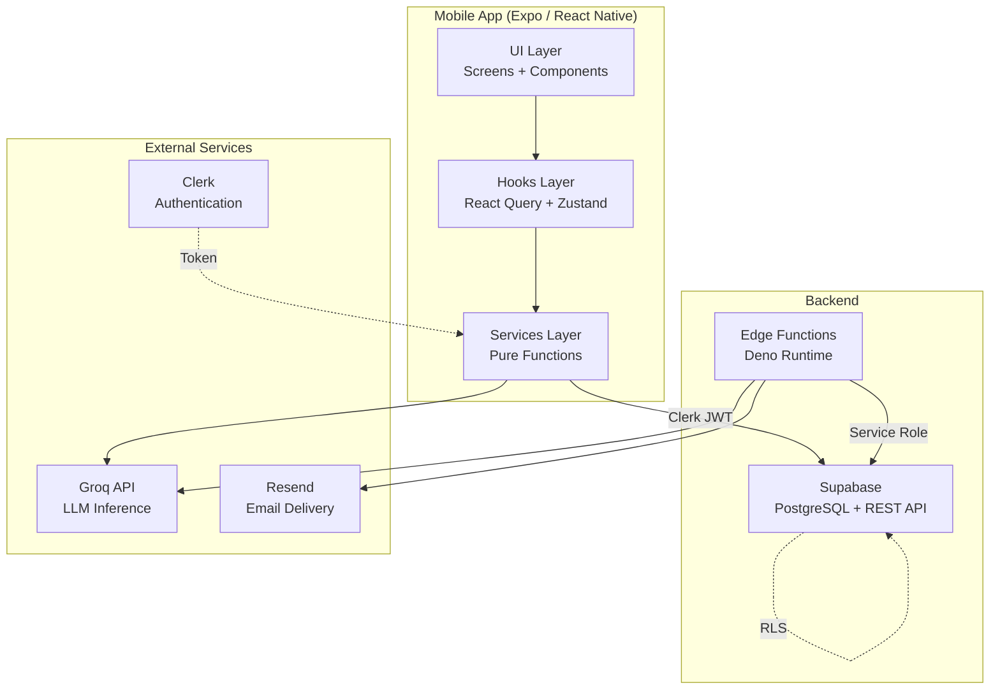
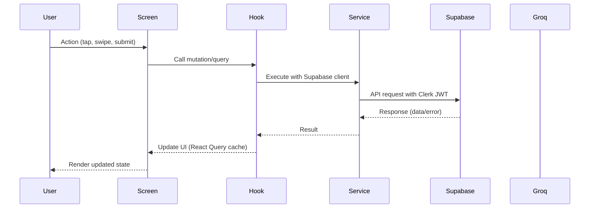
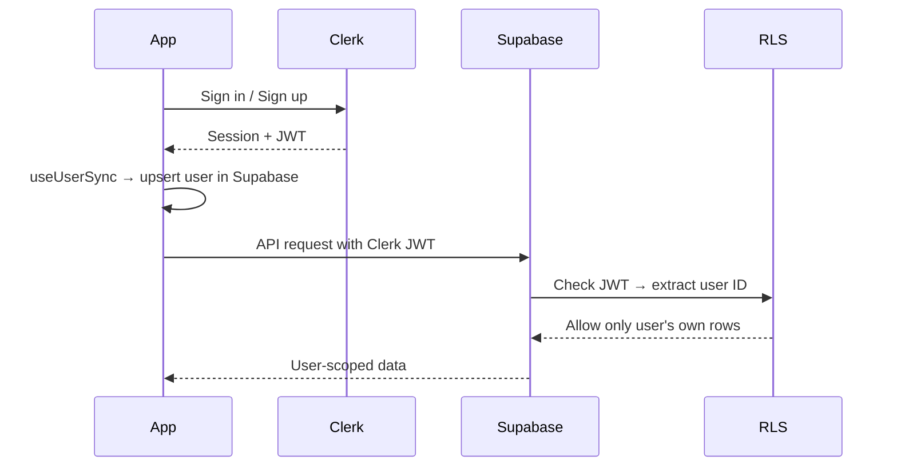
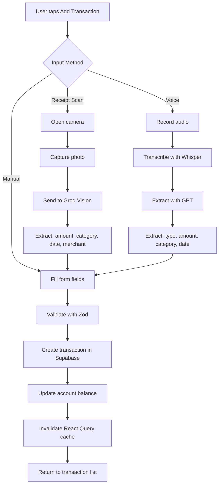
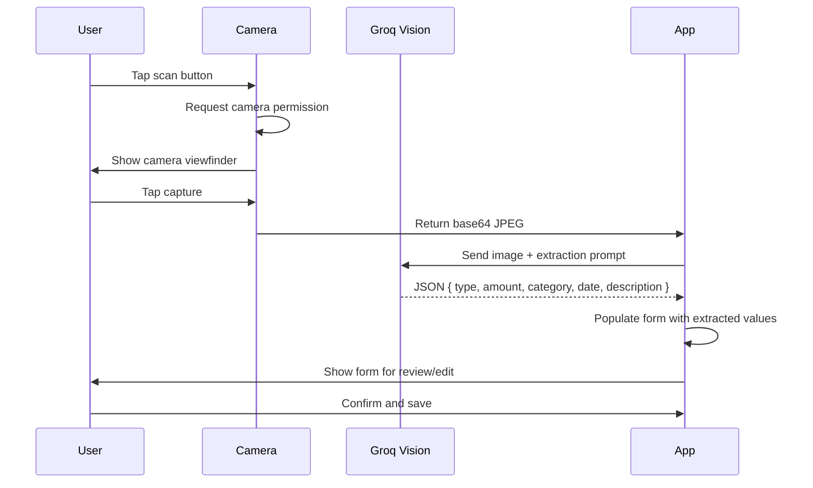
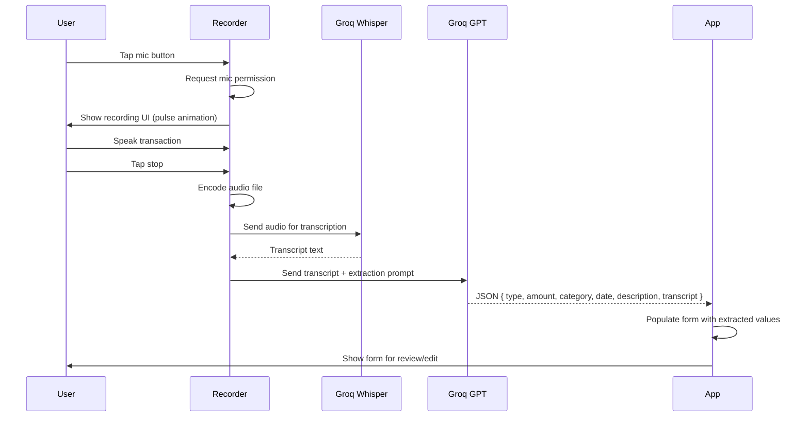
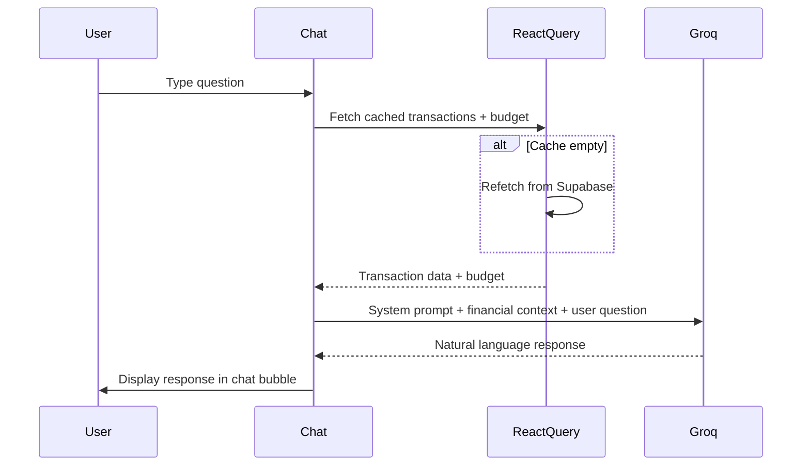
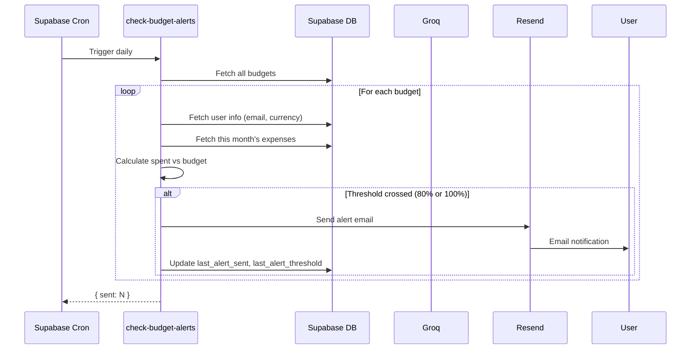
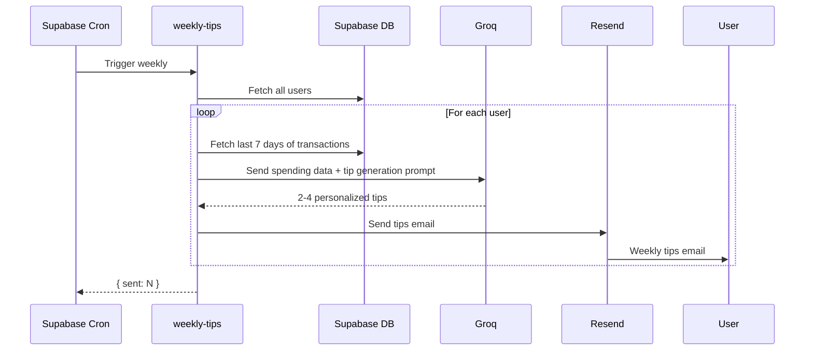
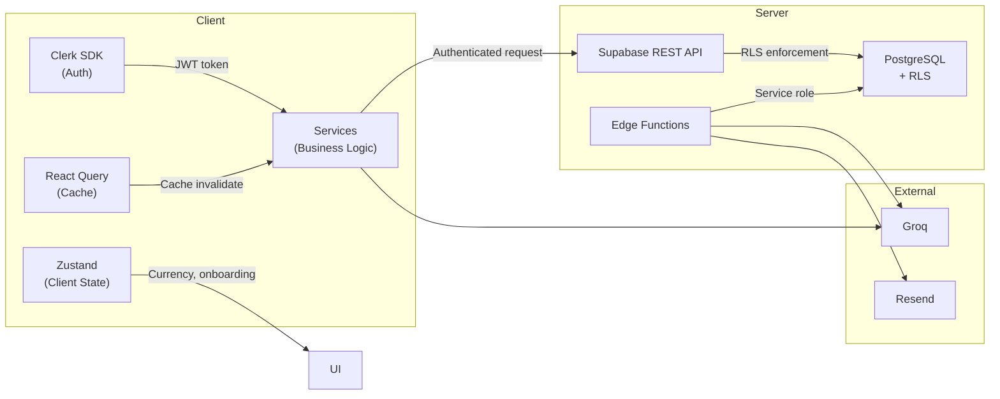

<div align="center">

# Welth

**AI-powered personal finance tracker built with Expo, Supabase, Clerk, and Groq.**

Track income and expenses, scan receipts with AI, log transactions by voice, chat with a financial assistant, and get personalized weekly tips — all from your phone.

[](https://reactnative.dev/)
[](https://expo.dev/)
[](https://www.typescriptlang.org/)
[](https://supabase.com/)
[](https://clerk.com/)
[](https://groq.com/)

</div>

---

## Table of Contents

- [Project Overview](#project-overview)
- [Real-World Use Case](#real-world-use-case)
- [Key Features](#key-features)
- [Tech Stack](#tech-stack)
- [Architecture](#architecture)
- [Folder Structure](#folder-structure)
- [Application Flow Diagrams](#application-flow-diagrams)
- [Data Flow](#data-flow)
- [AI Integration](#ai-integration)
- [Security](#security)
- [Error Handling](#error-handling)
- [Scalability](#scalability)
- [Future Improvements](#future-improvements)
- [Getting Started](#getting-started)
- [Conclusion](#conclusion)

---

## Project Overview

Welth is a cross-platform mobile application that helps users take control of their personal finances. It combines traditional budgeting tools with modern AI capabilities — receipt scanning, voice-based transaction logging, and a conversational financial assistant — to make managing money effortless.

The application solves a simple problem: most finance apps force you to manually enter every transaction. Welth removes that friction by letting you snap a photo of a receipt or just say what you spent, and the AI handles the rest.

### Core Capabilities

| Capability | Description |
|------------|-------------|
| **Transaction Tracking** | Record income and expenses with categories, accounts, dates, and descriptions |
| **Multi-Account Management** | Organize money across cash, bank, credit card, and savings accounts |
| **AI Receipt Scanning** | Photograph a receipt and extract merchant, amount, category, and date automatically |
| **Voice Transaction Logging** | Speak a transaction and have AI transcribe and categorize it |
| **AI Financial Assistant** | Ask natural-language questions about your spending and get data-driven answers |
| **Budget Monitoring** | Set monthly budgets with automatic email alerts at 80% and 100% thresholds |
| **Weekly AI Tips** | Receive personalized, actionable finance tips via email every week |
| **170+ Currencies** | Full international currency support with proper formatting |
| **CSV Export** | Export recent transactions as a spreadsheet |

---

## Real-World Use Case

Imagine a freelancer who earns in multiple currencies, pays for business expenses out of personal accounts, and needs to track everything for tax season. With Welth:

1. **Morning coffee** — Snap a photo of the receipt. AI extracts the store name, amount, category (Food & Dining), and date.
2. **Client payment** — Say "I received 5000 rupees from Acme Corp for consulting." Voice entry logs it as Income → Freelance.
3. **Monthly rent** — Manually add a recurring expense. Set a budget to ensure spending stays on track.
4. **Weekly review** — Open the AI assistant and ask "How much did I spend on food this month?" or "What's my biggest expense category?"
5. **Budget alert** — Get an email when spending crosses 80% of the monthly budget, giving time to adjust.
6. **Tax prep** — Export the last 30 days of transactions as CSV and send to the accountant.

The value is **reduced friction**. Instead of opening an app, tapping through forms, and choosing categories, users can photograph or speak their transactions in seconds.

---

## Key Features

### Authentication

Clerk-powered authentication with email/password sign-up, email verification codes, and optional multi-factor authentication (MFA) via email code. Sessions are managed by Clerk and tokens are passed to Supabase for Row Level Security.

### Onboarding

New users select their preferred currency (from 170+ options) and enter a starting balance. This creates their first account and a seed transaction.

### Account Management

Users can create multiple accounts (Cash, Bank, Credit Card, Savings), edit names and types, set a default account, and delete accounts. Deleting an account with transactions prompts a confirmation and removes associated transactions.

### Transactions

Full CRUD for transactions with:
- Type (Income / Expense)
- 21 categories (15 expense, 6 income)
- Account association
- Date picker
- Optional description
- Input method tracking (Manual, Receipt Scan, Voice)
- Swipe-to-delete gesture
- Search and filter by type and account
- Daily income vs. expense bar chart

### Budgets and Alerts

Set a monthly spending budget. The home screen shows a progress bar with color-coded thresholds (green → yellow → red). A Supabase Edge Function runs daily, checking every user's spending against their budget and sending email alerts at 80% and 100% thresholds via Resend.

### Currency Support

170+ currencies via `currency-codes` and `currency-symbol-map`. Currency preference is stored per user in Supabase and affects all price formatting throughout the app. Changing currency updates the display immediately.

### Receipt Scanning

Camera-based receipt capture using `expo-camera` with an image picker fallback. The receipt image is sent to Groq's vision model (`qwen/qwen3.6-27b`) which extracts the merchant name, total amount, category, and date into structured JSON.

### Voice Transaction Extraction

Audio recording via `expo-audio` with a custom animated recording UI. The audio is transcribed using Groq's Whisper model (`whisper-large-v3-turbo`), then the transcript is passed to a second Groq call (`openai/gpt-oss-20b`) that extracts type, amount, category, date, and description.

### AI Financial Assistant

A chat interface where users ask questions like "How much did I spend on food?" or "Am I over budget?" The assistant receives the user's last 30 days of transaction data, budget info, and spending breakdown as context, then answers using Groq's `openai/gpt-oss-20b` model.

### Weekly AI Tips

A Supabase Edge Function runs weekly, queries each user's last 7 days of spending, and sends a Groq prompt to generate 2-4 personalized, actionable finance tips. Tips are delivered via Resend email.

### Email Notifications

Two types of scheduled emails:
- **Budget alerts** — Sent daily when spending crosses 80% or 100% of the monthly budget
- **Weekly tips** — Sent weekly with AI-generated personalized financial advice

Both use a shared HTML email template with the Welth brand.

### CSV Export

Export the last 30 days of transactions as a CSV file with proper escaping and share it via the native share sheet.

---

## Tech Stack

### Frontend

| Technology | Version | Purpose |
|------------|---------|---------|
| **React Native** | 0.85 | Cross-platform mobile UI framework |
| **Expo SDK** | 56 | Managed workflow, native modules, build tooling |
| **Expo Router** | 56.2 | File-based routing with typed routes |
| **TypeScript** | 6.0 | Static type checking |
| **NativeWind** | 4.2 | TailwindCSS styling for React Native |
| **React Native Reanimated** | 4.3 | Smooth animations (recording pulse, card sweep) |
| **React Native Gesture Handler** | 2.31 | Swipeable transaction rows, gestures |
| **react-native-gifted-charts** | 1.4 | Pie charts (expense breakdown) and bar charts (daily income vs expense) |
| **react-native-ui-datepicker** | 3.3 | Date picker component |

### Backend / Database

| Technology | Purpose |
|------------|---------|
| **Supabase** | PostgreSQL database, REST API, Edge Functions, local dev environment |
| **Supabase Edge Functions** | Serverless Deno functions for scheduled tasks (budget alerts, weekly tips) |
| **Resend** | Transactional email delivery (budget alerts, weekly tips) |

### Authentication

| Technology | Purpose |
|------------|---------|
| **Clerk** | Email/password auth, MFA (email code), session management, user profiles |
| **@clerk/expo** | Clerk SDK for React Native with secure token caching |

### AI / ML

| Technology | Purpose |
|------------|---------|
| **Groq API** | Ultra-fast LLM inference for all AI features |
| `openai/gpt-oss-20b` | Text chat (assistant), voice transaction extraction |
| `qwen/qwen3.6-27b` | Vision model for receipt image understanding |
| `whisper-large-v3-turbo` | Speech-to-text for voice transaction entry |

### State Management

| Technology | Purpose |
|------------|---------|
| **TanStack React Query v5** | Server state caching, refetching, invalidation for accounts/transactions/budgets |
| **Zustand** | Lightweight client state (currency preference, onboarding status) |
| **React Hook Form** | Form state management with validation |
| **Zod** | Schema validation for forms (auth, onboarding, transactions) |

### Tooling

| Technology | Purpose |
|------------|---------|
| **Bun** | Package manager and lockfile |
| **date-fns** | Date manipulation and formatting |
| **currency-codes** | ISO 4217 currency data |
| **currency-symbol-map** | Currency code to symbol mapping |
| **expo-camera** | Camera access for receipt scanning |
| **expo-audio** | Audio recording for voice entry |
| **expo-image-picker** | Photo library access for receipt upload |
| **expo-file-system** | File I/O for CSV export, audio file handling |
| **expo-sharing** | Native share sheet for CSV export |
| **expo-secure-store** | Secure token storage for Clerk |

---

## Architecture

### High-Level Architecture



### Request Flow



### Authentication & Data Access Flow



---

## Folder Structure

```
finance-platform/
├── src/
│   ├── app/                          # Expo Router screens (file-based routing)
│   │   ├── _layout.tsx               # Root layout: Clerk + React Query providers
│   │   ├── index.tsx                 # Entry redirect: sign-in or (tabs)
│   │   ├── (auth)/                   # Unauthenticated routes
│   │   │   ├── _layout.tsx           # Auth stack, redirect if signed in
│   │   │   ├── sign-in.tsx           # Email/password + MFA verification
│   │   │   └── sign-up.tsx           # Registration + email verification
│   │   └── (root)/                   # Authenticated routes
│   │       ├── _layout.tsx           # Auth guard, onboarding redirect, user sync
│   │       ├── onboarding.tsx        # Currency + starting balance setup
│   │       └── (tabs)/               # 5-tab navigation
│   │           ├── _layout.tsx       # Tab bar (iOS native / Android JS fallback)
│   │           ├── index.tsx         # Home: balance, charts, recent transactions
│   │           ├── transactions.tsx  # Transaction list, search, filter, chart, export
│   │           ├── add-transaction.tsx # Manual/AI/voice transaction entry
│   │           ├── assistant.tsx     # AI chat interface
│   │           └── profile.tsx       # Avatar, accounts, currency, sign out
│   └── components/                   # Reusable UI components
│       ├── AccountModal.tsx          # Create/edit/delete accounts
│       ├── AIActionCard.tsx          # Animated gradient card (scan/voice)
│       ├── BudgetModal.tsx           # Set/remove monthly budget
│       ├── CalendarPicker.tsx        # Date picker
│       ├── currencyPicker.tsx        # Full-screen currency selector
│       ├── FormSheetModal.tsx        # Reusable bottom sheet modal
│       ├── GradientIconButton.tsx    # Gradient circle button with loading
│       ├── PillGroup.tsx             # Scrollable pill selector
│       ├── ReceiptScannerModal.tsx   # Camera view for receipts
│       ├── TransactionRow.tsx        # Swipeable transaction row
│       └── VoiceRecorderModal.tsx    # Animated voice recording UI
├── hooks/                            # React hooks
│   ├── useSupabase.tsx              # Authenticated Supabase client
│   ├── useUserSync.ts               # Sync Clerk user → Supabase on launch
│   ├── mutations/                    # React Query mutations
│   │   ├── useAccountMutation.ts    # Account CRUD + set default
│   │   ├── useBudgetMutations.ts    # Budget upsert + delete
│   │   └── useTransactionMutations.ts # Transaction create + delete
│   └── queries/                      # React Query queries
│       ├── useAccountsQuery.ts      # Fetch user accounts
│       ├── useBudgetQuery.ts        # Fetch user budget
│       └── useTransactionsQuery.ts  # Fetch transactions with filters
├── lib/                              # Business logic (no React)
│   ├── supabase.ts                  # Clerk-authenticated Supabase client factory
│   ├── utils.ts                     # formatPrice, dayKey, CSV export
│   ├── query/                       # React Query configuration
│   │   ├── client.ts                # QueryClient (staleTime: 30s)
│   │   └── key.ts                   # Query key factories
│   ├── schemas/                     # Zod validation schemas
│   │   ├── auth.ts                  # Sign-in, sign-up, code schemas
│   │   ├── onboarding.ts            # Starting balance schema
│   │   └── transactions.ts          # Transaction form schema
│   └── services/                    # Pure data functions
│       ├── account.ts               # Account CRUD via Supabase
│       ├── assistant.ts             # Groq AI chat assistant
│       ├── budgets.ts               # Budget CRUD via Supabase
│       ├── extractTransaction.ts    # Receipt vision + voice transcription
│       └── transactions.ts          # Transaction CRUD + balance sync
├── types/                            # TypeScript type definitions
│   ├── account.ts                   # Account, AccountType
│   ├── budget.ts                    # Budget
│   └── transaction.ts              # Transaction, NewTransaction, ExtractedTransaction
├── constants/                        # App constants
│   ├── categories.ts                # 21 categories with labels, icons, colors
│   └── theme.ts                     # Gradient and color constants
├── store/                            # Zustand global state
│   └── userStore.ts                 # Currency, needsOnboarding
├── supabase/                         # Backend infrastructure
│   ├── config.toml                  # Supabase local dev configuration
│   └── functions/                   # Edge Functions (Deno)
│       ├── _shared/                 # Shared utilities
│       │   ├── deno.d.ts           # Deno type declarations
│       │   ├── emailLayout.ts      # Shared HTML email template
│       │   ├── resend.ts           # Resend email API helper
│       │   └── supabaseAdmin.ts    # Service-role Supabase client
│       ├── check-budget-alerts/
│       │   └── index.ts            # Daily: budget threshold email alerts
│       └── weekly-tips/
│           └── index.ts            # Weekly: AI-generated finance tips
├── assets/                           # Images, icons, splash screens
├── .env                              # Environment variables (gitignored)
├── app.json                          # Expo configuration
├── tailwind.config.js                # NativeWind / TailwindCSS theme
├── tsconfig.json                     # TypeScript config with path aliases
└── package.json                      # Dependencies and scripts
```

---

## Application Flow Diagrams

### Transaction Creation Flow



### Receipt Scanning Flow



### Voice Transaction Flow



### AI Assistant Flow



### Budget Alert Flow



### Weekly Tips Flow



---

## Data Flow

### How User Data Moves Through the Application



### Data Ownership

Every row in the database is scoped to a user via `user_id` (which matches the Clerk `clerk_id`). Supabase RLS policies ensure users can only read and write their own data. Edge Functions bypass RLS using a service-role key but only access data needed for scheduled tasks (budget checks, weekly tips).

| Table | Owner Field | Access |
|-------|-------------|--------|
| `users` | `clerk_id` | Own profile only |
| `accounts` | `user_id` | Own accounts only |
| `transactions` | `user_id` | Own transactions only |
| `budgets` | `user_id` | Own budget only |

---

## AI Integration

### Why Groq

Groq provides ultra-fast LLM inference with low latency, which is critical for a mobile app where users expect near-instant responses. The receipt scanning and voice extraction flows require fast turnaround to feel responsive.

### Models Used

| Model | Provider | Use Case |
|-------|----------|----------|
| `openai/gpt-oss-20b` | Groq | AI assistant chat, voice transaction extraction |
| `qwen/qwen3.6-27b` | Groq | Receipt image understanding (vision) |
| `whisper-large-v3-turbo` | Groq | Audio transcription for voice entry |

### Receipt Extraction

The vision model receives the receipt image as a base64 data URL along with a structured prompt requesting JSON output with `type`, `amount`, `category`, `description`, and `date`. The response is parsed and validated before populating the form. If any field is `null`, the user is prompted to fill it manually.

### Voice Transcription + Extraction

A two-step process:
1. **Whisper** transcribes the audio recording to text
2. **GPT** extracts structured transaction data from the transcript, resolving relative dates ("yesterday", "last Monday") using today's date

### Financial Assistant

Receives a system prompt defining it as a personal finance assistant, plus a context block containing:
- Last 30 days summary (income, expense)
- Spending by category
- Monthly budget status
- Recent transaction list (up to 40 entries)

The model answers questions using only this provided data and declines to guess when information is insufficient.

### Weekly Tips

A scheduled Edge Function queries each user's last 7 days of expenses, builds a category breakdown, and sends it to Groq with a prompt to generate 2-4 short, actionable, personalized tips. Tips are delivered via email.

### Error Handling for AI

- **Missing API key** — Throws immediately with a clear error message
- **API timeout/failure** — Error is caught, logged, and a user-friendly message is shown
- **Invalid JSON response** — `JSON.parse` errors are caught; user is asked to try again
- **Empty response** — Checked before parsing; throws if no content returned
- **Malformed extraction** — Null fields trigger a "Review before Saving" alert listing missing data

---

## Security

### Authentication

- **Clerk** handles all authentication logic (sign-up, sign-in, MFA, session management)
- Clerk publishable key is the only auth credential exposed to the client (safe by design)
- Session tokens are cached securely via `expo-secure-store`

### Supabase Access

- The client uses the **anon (public) key** — all data access is governed by RLS policies
- Every table has RLS enforcing `user_id = auth.uid()` (mapped from Clerk JWT)
- **Edge Functions** use a **service-role key** (stored in Supabase secrets, never exposed to the client) to bypass RLS for scheduled cross-user operations

### API Keys & Secrets

| Credential | Location | Exposure |
|------------|----------|----------|
| Clerk Publishable Key | `.env` as `EXPO_PUBLIC_*` | Client bundle (safe — public by design) |
| Supabase URL | `.env` as `EXPO_PUBLIC_*` | Client bundle (safe — project URL) |
| Supabase Anon Key | `.env` as `EXPO_PUBLIC_*` | Client bundle (safe — public, RLS-protected) |
| Groq API Key | `.env` as `EXPO_PUBLIC_*` | Client bundle (used for client-side AI calls) |
| Supabase Service Role Key | Edge Function secrets | Server-only, never exposed |
| Resend API Key | Edge Function secrets | Server-only, never exposed |
| Groq API Key (Edge) | Edge Function secrets | Server-only, for scheduled tasks |

### Edge Functions

- Run on Deno runtime within Supabase's infrastructure
- Use service-role client to access data across all users
- Each function validates required environment variables at startup
- Email functions validate recipient existence before sending

---

## Error Handling

### Approach

The application follows a **fail-forward** pattern: errors are caught, logged for debugging, and the user receives a meaningful message without the app crashing.

| Layer | Strategy |
|-------|----------|
| **Forms** | Zod schemas validate input before submission; field-level errors shown inline |
| **API calls** | Try/catch around every Supabase and Groq call; error logged + user alert |
| **React Query** | `isError` state triggers retry UI; `retry: 1` configured globally |
| **Mutations** | `onSuccess` invalidates cache; errors return structured `{ error }` objects |
| **Edge Functions** | Per-user try/catch so one failure doesn't block others; errors logged |
| **AI responses** | JSON parsed with fallback; null fields trigger review alerts |
| **Loading states** | Every data-fetching screen shows `ActivityIndicator`; buttons show `saving…` |
| **Empty states** | Every list shows an illustration + message when empty |

### User-Facing Error Messages

All user-facing errors are human-readable:
- "Failed to fetch accounts. Please try again."
- "We couldn't extract transaction details from the receipt."
- "Couldn't process that. Check your microphone permission."

Technical details are logged to `console.error` for debugging but never shown to users.

---

## Scalability

### Current Architecture Strengths

- **Serverless Edge Functions** — Budget alerts and weekly tips scale horizontally with Supabase
- **React Query caching** — Reduces redundant API calls; 30-second stale time
- **Service layer pattern** — Business logic is decoupled from React, enabling testability
- **RLS enforcement** — Database-level security scales without application-level checks

### Production Considerations

- **Rate limiting** — Groq API calls from the client should be rate-limited to prevent abuse
- **Edge Function retries** — Cron jobs should have idempotency guards for partial failures
- **Database indexing** — Queries filter on `user_id`, `date`, `type` — indexes on these columns are essential
- **Image compression** — Receipt images should be compressed before sending to Groq to reduce latency
- **Offline support** — Transaction creation could queue locally and sync when online
- **Push notifications** — Budget alerts could use push notifications in addition to email

---

## Future Improvements

- **Recurring transactions** — Auto-create monthly bills (rent, subscriptions)
- **Multi-currency conversion** — Real-time exchange rates for transactions in different currencies
- **Shared accounts** — Household budgeting with multiple users
- **Receipt storage** — Save receipt images in Supabase Storage for later reference
- **Spending trends** — Month-over-month comparison charts
- **Goal setting** — Savings goals with progress tracking
- **Push notifications** — Real-time budget alerts via Expo Notifications
- **Offline-first** — Queue transactions locally and sync when connected
- **Widget** — Home screen widget showing current month spending
- **Dark mode** — Full dark theme support (currently light-only on most screens)

---

## Getting Started

### Prerequisites

- Node.js 18+
- Bun (package manager)
- Expo CLI (`npm install -g expo-cli`)
- Supabase CLI (for Edge Functions)
- A [Clerk](https://clerk.com) account
- A [Supabase](https://supabase.com) project
- A [Groq](https://groq.com) API key
- A [Resend](https://resend.com) API key (for emails)

### Installation

```bash
# Clone the repository
git clone https://github.com/your-username/finance-platform.git
cd finance-platform

# Install dependencies
bun install

# Set up environment variables
cp .env.example .env
# Edit .env with your keys

# Start the development server
bun start
```

### Environment Variables

```env
# Clerk
EXPO_PUBLIC_CLERK_PUBLISHABLE_KEY=pk_test_...

# Supabase
EXPO_PUBLIC_SUPABASE_URL=https://your-project.supabase.co
EXPO_PUBLIC_SUPABASE_KEY=your-anon-key

# Groq
EXPO_PUBLIC_GROQ_API_KEY=gsk_...
```

### Supabase Edge Functions

```bash
# Link to your Supabase project
supabase link --project-ref your-project-ref

# Set secrets
supabase secrets set RESEND_API_KEY=re_...
supabase secrets set RESEND_FROM_EMAIL=noreply@yourdomain.com
supabase secrets set GROQ_API_KEY=gsk_...

# Deploy functions
supabase functions deploy check-budget-alerts
supabase functions deploy weekly-tips

# Set up cron jobs (see supabase/config.toml)
```

---

## Conclusion

Welth demonstrates a practical, full-stack mobile application that combines:

- **Modern mobile development** — Expo SDK 56, file-based routing, native animations, platform-specific UI
- **Secure authentication** — Clerk with MFA, JWT-based Supabase access, Row Level Security
- **Serverless backend** — Supabase PostgreSQL with Edge Functions for scheduled tasks
- **AI integration** — Receipt scanning (vision), voice transcription, conversational assistant, personalized tips — all powered by Groq
- **Production patterns** — React Query caching, service layer architecture, Zod validation, structured error handling

The project shows how AI can be woven into a practical application not as a gimmick, but as a core feature that reduces friction and adds genuine value. Snapping a receipt instead of typing details, speaking a transaction instead of filling a form, and asking questions about your finances in natural language — these are the kinds of interactions that make finance apps feel modern and effortless.

Built with Expo, Supabase, Clerk, and Groq.

---

Thanks for checking out Welth! Hope you find it useful.

**Suraj Gupta** — surajgupta7070031833@gamil.com
